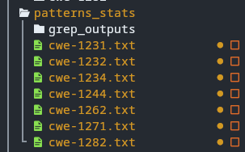
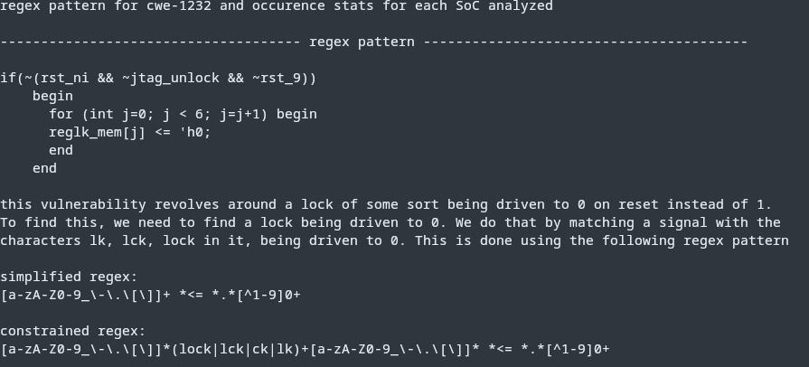
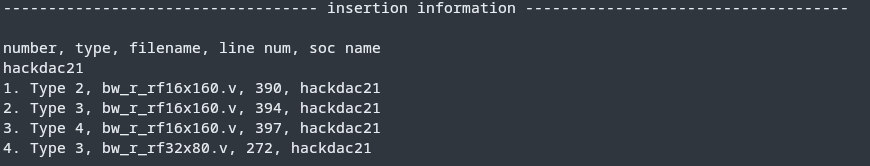
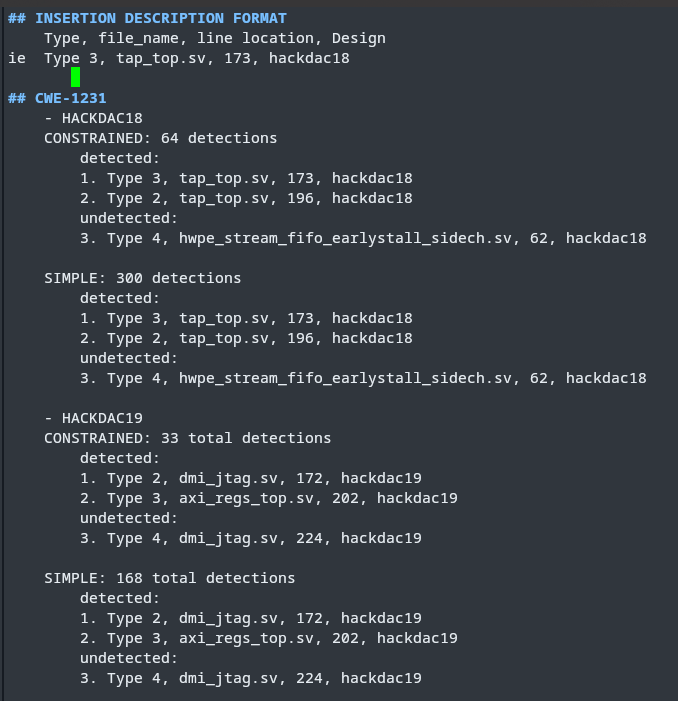
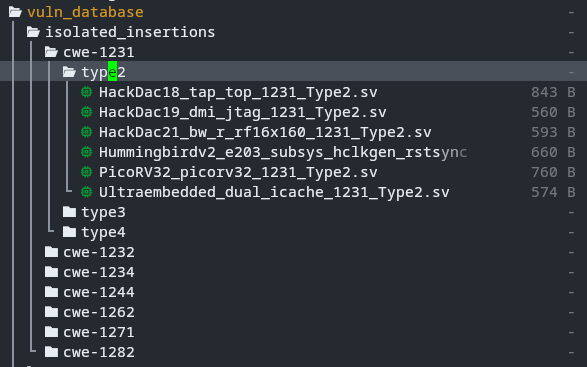
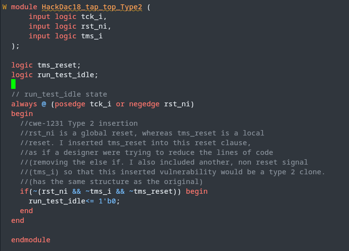
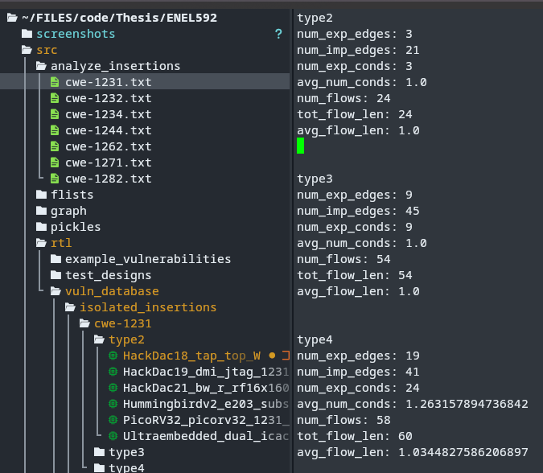

# ENEL594 - Implementation

## Description
- This repo contains all work completed as part of my research in ENEL592 and ENEL594. This includes several different tools, techniques and data sets based on the two semesters of work. These can be described as follows. 

### ENEL594 Work

1. A series of text based (grep) scanners, along with the results of running them on 7 open source cores and SoCs. These can be found in ```./src/rtl/vuln_database/pattern_stats```. The actual output from running these scanners is also saved in the grep_outputs folder.

2. A series of 47 vulnerabilty mutations, which were inserted into the previously mentioned 7 open source hardware designs. These 47 mutations included descriptions of     how the vulnerability is implemented, and why it can be categorized as the vulnerability that it has been categorized under. These inserted vulnerabilties can be found in ```./src/rtl/isolated_insertions```, each in their respective folders. They are categorized based on MITRE's CWE Enumeration, and are broken down based on Hardware Description Clone classification (type 2, type 3, type 4.)

3. A python script that generates Hyperflow Graphs for all 47 isolated vulnerability insertions, and analyzes some statistics about their explicit flows, implict flows     and other relevant characteristics. This script is named analyze_insertions.py, and the genearated statistics can be found in ```./src/analyze_insertions```

4. Hyperflow Graph visualizations for all 47 isolated vulenrabilties are generated as part of the previously mentioned analysis. They can be found in the ```./src/graph``` subfolder.

## Installation and Setup
- This tool makes use of Python 3, so a valid python 3 interpreter is required. To setup / install all required dependancies for the tool. For those using a bash based terminal emulator all that is required to setup the tool is

    1. making the setup.sh bash script executable.
    2. executing the setup.sh bash script.

- this can be done using the following commands from the root of the directory

    1. ```chmod +x setup.sh```
    2. ```./setup.sh```

- otherwise, the install steps can be performed manually
    
    1. ```python3 -m venv ./.venv```
    2. ```source .venv/bin/activate```
    3. ```pip install pyslang==3.0.310```
    4. ```pip install codetiming```

- this will install all required dependancies to run the Hyperflow Graph

## Using the text based scanners (regexs)

- As previously stated, all regex / text based scanners can be found within the ```./src/rtl/vuln_database/pattern_stats``` folder. Within that folder, you will find another sub folder labeled "grep_outputs", and 7 other text files, each named after their respective CWE. The folder should look like the following




- Each of the 7 cwe files that can be found within this folder follows the same structure. Each has 3 sections, the first of which named *regex pattern*, contains an example vulnerabiltiy implementation, a description of the vulnerability, and one or more regex patterns developed to detect instances of the given CWE.




- Each file will contain 1 or more regex patterns within this section, each of differing 'scope' or featuring other improvements. For example, in the previous screenshot, there were two regex patterns, one refered to as `simple regex` and another `constrained regex`. The "simple" regex is looking for lines of code that match a specific structure only, whereas the 'constrained' regex instead is looking for lines that match the same specific structure and use specific keywords for signal names. This naming convention holds for all 7 files, where there will usually be 2 regex patterns. In some cases, there may be more regex patterns using the `modified` naming convention. This simply means that the originally developed regex patterns did not perform well, so some work was done to improve them, thus creating modified regex patterns in addition to the origianl two.

### Using one of the Regex Patterns

- Using any of the Regex Patterns that can be found within each file is rather simple, and simply requires a hardware design you would like to analyze, and access to the `grep` utility. If these conditions are met, each regex pattern can simply be copied from the file, and used in the following command. First, navigate in a terminal to the project you would like to analyze, then run the following, substiting your given regex pattern and the desired output file name 

    ```grep -P -n -v -r "regex_pattern_goes_here" * > name_of_output_file.txt```

- This command will use the grep utility to recursively run the regex pattern on each file within the current directory and any subdirectories, piping any matches along with their line number and file name into the output file. 

### Other Details In Each Pattern Stat file

- During this process, you may have noticed two other sections in each of the Pattern Stat files. These sections are named `Occurence Stats` and `Insertion Information`. The Occurence Stats section provides some information on the number of detections I found when running these scanners on the 7 open source designs I chose for analysis. The Insertion Information section then describes all the Vulnerabilities of the specific CWE type (same as described earlier in the file) that were inserted across the 7 desgins. 

    

- The previous screenshot shows an example Insertion Infromation section. Here, the insertions performed on the Hack@Dac21 Open SoC design for a given CWE are shown, along with the layout of the information. Each inserted instance is recorded based on it's clone type (2, 3, or 4), the name of the file in which it lives, the line number where it was inserted (roughly), and the name of the design in which it was inserted.

## Regex / Scanner Results 

- After creating the regex patterns / scanners for each of the chosen 7 CWEs, I ran each regex pattern / scanner on all 7 chosen open source hardware designs, and captured the results. Both the raw results recieved from the scanners, as well as more analyzed results have been captured in the `./src/vuln_database/regex_cwe_detection_stats` directory. This folder contains several subfolders, each of which contain the raw text files obtained from running each of the scanners on all 7 open source designs. I analyzed these results to 1. which inserted vulnerabilties were detected, 2. which weren't detected, and 3. The number of other detects found in both cases (noise). 

    

- The above screenshot shows a section of these results, the file of which is aptly name results.md. The file is broken down in a hierarchical manner, Where results of running each scanner associated with each CWE on each of the 7 open source designs are shown. Inserted vulnerabilties are categorized as detected, or not detected by each scanner. In the case a inserted vulnerabiltiy has been detected, the number of other lines reported as possibly being vulnerable by the scanner are recorded. This provides a rough aproximation to the number of false positives reported by the scanner. In the case a inserted vulnerabiltiy hasn't been detected, the number of other lines that were detected is also recorded. 

## Hyperflow Graph Analysis

### Isolated Insertions

- As part of my work this year, I also performed a short Hyperflow Graph based analysis of each Inserted Vulnerability (shorter than I would like.) Each vulnerabiltiy that was inserted into one of the chosen 7 open source designs was extracted, and isolated into it's own module (serving as a description of the vulnerabiltiy). These `isolated insertions` can be found in the `./src/vuln_database/isolated_insertions` directory. 

    

- Each inserted vulnerabiltiy was categorized based on it's associated CWE, and it's code clone classification (type 2, 3, or 4.) As can be seen from the above screenshot, this resulted in the following directory structure. Each isolated insertion is kept as it's own system verilog file, with all the logic pertaining to the vulnerabiltiy captured within the module. The following screenshot showcases one such isolated insertion. Each insertion includes the necesary logic to properly represent the vulnerabiltiy in isolation, as well as a description / explanation behind the inserted vulnerability. 

    

### Hyperflow Graph Analysis and Generation

- To try and understand the differences between all of the inserted vulnerabilties, especially amongst those of the same CWE type (but different code clone classification), I wrote a python program to generate a hyperflow graph for each of the 47 inserted vulnerabilties, and develop some statistics about their characteristics. I had orignally intended to develop a better comparison algorithm, but that is left as future work. 

- To generate both the hyperflow graph statistics for each inserted vulnerabilty, as well as create visual graph representations of each vulnerabilty, one must simply use the provided bash script. In a bash based terminal, from the highest directory level of the project, run the following command

    ```./analyze_insertions.sh```

- Running this command will create the Hyperflow Graphs for each of the isolated insertions, and genearate statistics about their characteristics. The generated graphs can be found in `./src/graph`, where they can be found according to their isolated insertion module name. The generated statistics can be found in the `./src/analyze_insertions` directory, where again each text file is named in accordance with the associated isolated vulnerability. 

    

- The above screenshot showcases one of the 7 generated statistic files. One file is generated for each of the 7 CWEs, and several statistics are given in each file. The statistics break down the number of Explicit, Implict, number of conditions found on explicit edges, average number of conditions, the total number of flows, the total len of all flows combined, and the average flow length for each code clone classification of each CWE. In the above screenshot, statistics are shown for CWE-1231 Insertions of Type 2, Type 3, and Type 4 clone classifications.

    

- The above screenshot shows an example of a Hyperflow Graph generated for one of the isolated insertions. Nodes represent signals in the isolated insertion module, and edges between each node represent implicit or explict inforamtion flows between signals.


