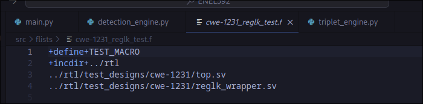
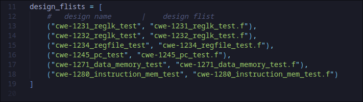
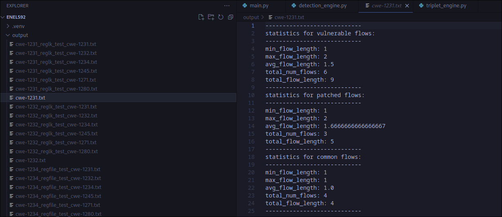
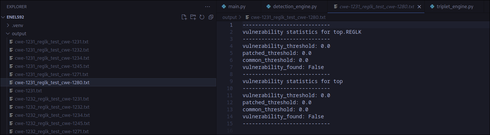

# ENEL592 - Implementation

## Description
- This repo contains a basic implementation of a hardware vulnerability detection tool. The tool is built on top of a preexisting tool, which generates graph representations of Hardware Designs called a HyperFlow Graph. This representation is used to perform analysis on a vulnerability, it's patch, and the hardware system selected for vulnerability detection. The output of this tool is a set of statistics about the given vulnerability, it's patch, as well as information on whether the modules in the chosen hardware system feature the given vulnerbaility. For the moment, this tool is only able to detect type 1 vulnerabilities, which means it is only able to find exact copies.

## Install, Setup, and Run the tool

### Instalation Procedure
- This tool makes use of Python 3, so a valid python 3 interpreter is required. To setup / install all required dependancies for the tool. For those using a bash based terminal emulator all that is required to setup the tool is

    1. making the setup.sh bash script executable.
    2. execturing the setup.sh bash script.

- this can be done using the following commands from the root of the directory

    1. ```chmod +x setup.sh```
    2. ```./setup.sh```

- otherwise, the install steps can be performed manually
    
    1. ```python3 -m venv ./.venv```
    2. ```source .venv/bin/activate```
    3. ```pip install pyslang==3.0.310```
    4. ```pip install codetiming```

### Run the tool
- Running the tool is simple. Just use the provided bash shell script or run the main.py file manually.

- bash
    1. ```chmod +x run.sh```
    2. ```./run.sh```

- manual
    1. ```python3 src/main.py```


## Examples

### Adding a vulnerability for analysis
- To add a new vulnerability to the tool for analysis against the designs, please perform the following procedure.

1. Add the example vulnerable module and it's asssociated patched module to the src/rtl folder.

At the moment, all vulnerabilities are being stored in src/rtl/example_vulnerabilities. Feel to free to add any new vulnerabilities to that folder, or create a new folder in the rtl folder for it. For an example of how to organize your vulnerable and patched modules, please see src/rtl/example_vulnerabilities/cwe-1231.

2. Create two new file list definiton files in the src/flists folder.

These files will be respobsible for telling the tool where your vulnerability example or patched module are located in your file system. Create a new file with the .f extension, and give it the contents shown in the following screenshot. This is an example from src/flists/cwe-1231.f, but please modify the last line to match the location of your desired file. 


3. Add the name of the vulnerability, and the path to it's associated vulnerability example / patch flist files to src/data.py

This tool uses a file called data.py to store the names and locations of all the files it will be working with. This all done in a signle place to make adding or removing vulnerabilities and designs easy. Please insert the name of vulnerability, the path to it's vulnerable flist, and then the path to it's patch flist into the following list .


That should be all thats required! Now when you run the tool using the script file, your vulnerability will automatically be used for analysis performed on the designs.

### Addding a design for analysis

- To add a new design to the tool for analysis, please perform the following steps.

1. Add the design to the src/rtl folder.

At the moment, all designs are being stored in src/rtl/test_designs. Feel to free to add any new designs to that folder, or create a new folder in the rtl folder for it. Please see the src/rtl/test_designs/cwe-1231 for an example design.

2. Create a new file list definiton files in the src/flists folder.

This file will be respobsible for telling the tool where your design is located in your file system. Create a new file with the .f extension, and give it the contents shown in the following screenshot. This is an example from src/flists/cwe-1231_reglk_test.f. This design contains two modules, top.sv and reglk.sv. You can all the modules associated with your design in similar fasion, using a new line for each module. 



3. Add the name of the design, and the path to it's associated flist file to src/data.py

This tool uses a file called data.py to store the names and locations of all the files it will be working with. This all done in a signle place to make adding or removing vulnerabilities and designs easy. Please insert the name of the design, the path to it's flist file into the following list in data.py.



That should be all thats required! Now when you run the tool using the script file, your vulnerability will automatically be used for analysis performed on the designs.

## Output and Results

### Output

All data from the analysis that this tool produces is stored in ./output. After running the tool using a few vulnerabilties and designs, you will notice this folder is populated with many files. These files contain information on the vulnerability detection results for each design, as well as some stastics on the Vulnerability Triplets.

There are two main type of file produced by this tool.

1. Triplet information files.

These are files that only contain statistics and data associated with the triplet generated for a vulnerability. You can tell these files apart from other files, as their nname will strictly be the name of the vulnerability given in the data.py file. The following is an example of a Triplet information file for CWE-1231

This file provides information on the minimum, maximum, average, total number and total length of all flows for vulernable, patched and common flows associated with the vulnerability.



2. Design Analysis Result Files.

These files only contain results pertaining to the identification of a specific vulnerability within them. You can tell these files apart from others, as they are named starting with the name associated with the design given in the data.py file, follow by the vulnerability name that was scanned for in that file. For the example, the follow is a analysis result file for an analsys performed on the cwe-1231_reglk_test desing, scanning for cwe-1280.

This file provides information on the vulnerability status (True or False), as well the vulnerability, patch, and common threshold associated with the files analysis




